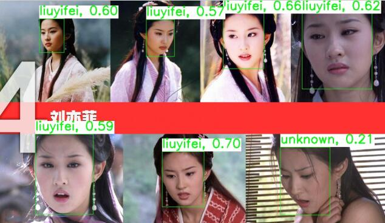
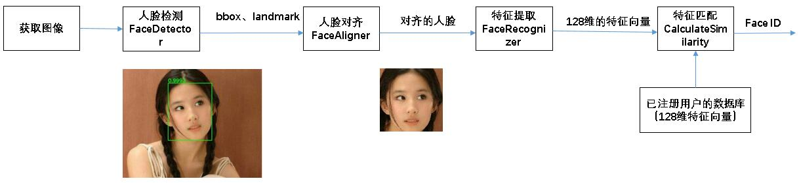
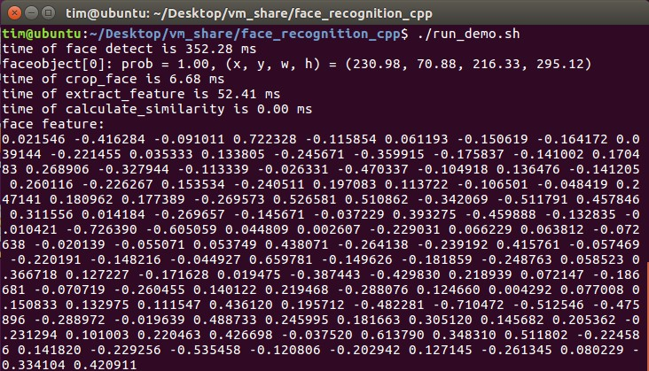
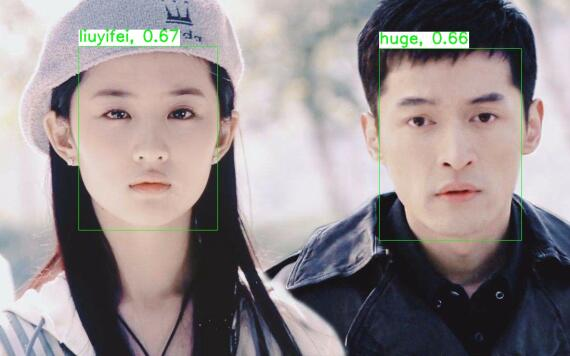
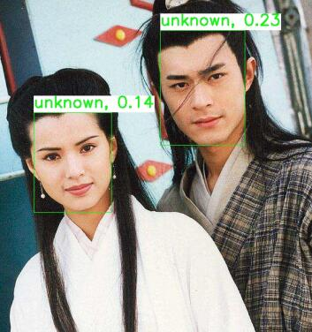

简体中文 | [English](README_en.md)


## EasyFace

A light weight face recognition project, high accuracy, real-time, cross-platform.

一个轻量级人脸识别项目，准确率高，实时运行，跨平台。在酷睿i7 CPU上耗时410ms。人脸检测模型RetinaFace在WIDER Face Hard上的准确率为0.791，人脸识别模型MobileFacenet在LFW上的准确率为99.55%。



### 特性

- 纯C++代码
- 与ncnn、opencv一样，可跨平台部署
- 可以使用自己的数据集重新训练人脸检测模型与人脸表征模型
- 方便集成各种的人脸检测模型和人脸表征模型
- 已集成的人脸检测算法：RetinaFace
- 已集成的人脸表征算法：MobileFacenet


## 人脸识别原理




### 实现细节

使用[RetinaFace](https://arxiv.org/abs/1905.00641)进行人脸检测，然后用[SimilarTransform](https://ieeexplore.ieee.org/document/88573) 和 [OpenCV Affine Transformations](https://docs.opencv.org/3.4/d4/d61/tutorial_warp_affine.html)获取对齐的人脸图像，再用MobileFacenet提取128维的特征向量，最后用余弦相似度计算人脸相似度。

## 依赖

- [opencv3.4+](https://github.com/opencv/opencv)
- [ncnn](https://github.com/EasyFaceOrg/ncnn)

编译依赖库，并修改CMakeLists.txt

## 编译

### Linux

`./build_linux.sh`

### aarch64 Linux

`./build_aarch64-linux-gnu.sh`

## 运行

### Linux

`./run_demo.sh`

运行结果
```
Start face register... 
filename: images/register/huge.jpg
username: huge
filename: images/register/liuyifei.jpg
username: liuyifei
Finish face register. 
Start face identify 
identify result: liuyifei, 0.55
save result to: images/identify/liuyifei.result.jpg
blank frame grabbed
Finish face identify.
```


Total time is about 410ms on Core i7 CPU.




### aarch64 Linux

`./build-linux/bin/face_system_demo models/retinaface/ models/mobilefacenet/ images/register/ images/identify/img1.jpg`


## 效果演示

已注册人脸：huge、liuyifei

未注册人脸：unknown

  


## TODO

- 人脸质量评估
- 人脸活体检测
- 性别年龄预测

[高效的人脸搜索](https://cloud.google.com/solutions/machine-learning/building-real-time-embeddings-similarity-matching-system?hl=zh-cn#hashing-based_approaches)


## 联系方式

Email：qianli_zh@qq.com

CSDN技术博客: https://blog.csdn.net/zhongqianli

EasyFace人脸技术交流群：1070763980


## 许可证书

[BSD 3 Clause](LICENSE)


## 致谢

[insightface](https://github.com/deepinsight/insightface)

[SeetaFace](https://github.com/seetafaceengine/SeetaFace2)

[ncnn](https://github.com/Tencent/ncnn)

[ncnn_example](https://github.com/MirrorYuChen/ncnn_example)

[opencv](https://github.com/opencv/opencv)
