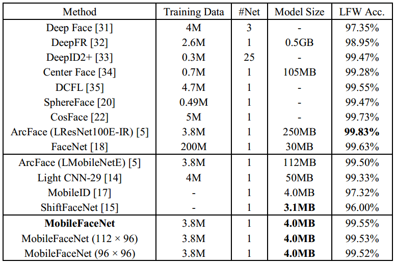

## Training Data

See [Dataset Zoo](https://github.com/deepinsight/insightface/wiki/Dataset-Zoo)

## MobileFacenet

## Accuracy

### Train MobileFacenet

See [MobileFaceNet training pipeline](https://github.com/deepinsight/insightface/issues/214)

## model conversion

Use ncnn's tools [`mxnet2ncnn`](https://github.com/Tencent/ncnn/blob/master/tools/mxnet/mxnet2ncnn.cpp) to convert mxnet's model to ncnn's model.

